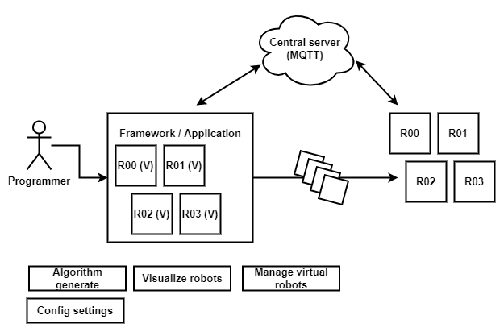
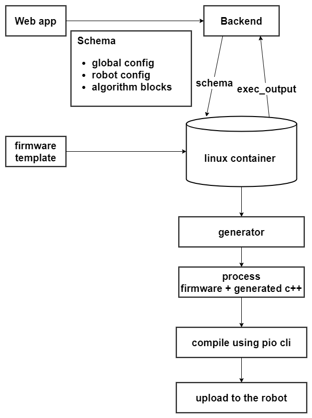

[comment]: # "This is the standard layout for the project, but you can clean this and use your own template"

# Swarm Intelligence Programming Framework

#### Team

- E/16/094, S.M. Ekanayaka, [e16094@eng.pdn.ac.lk](mailto:e16094@eng.pdn.ac.lk)
- E/16/221, H.M.K. Madushanka, [e16221@eng.pdn.ac.lk](mailto:e16221@eng.pdn.ac.lk)
- E/16/275, A.L.H.E. Perera, [e16275@eng.pdn.ac.lk](mailto:e16275@eng.pdn.ac.lk)

#### Supervisors

- Dr. Isuru Nawinne, [isurunawinne@eng.pdn.ac.lk](mailto:isurunawinne@eng.pdn.ac.lk)
- Prof. Roshan Ragel, [roshanr@eng.pdn.ac.lk](mailto:roshanr@eng.pdn.ac.lk)
- Dr. Mahanama Wickramasinghe, [mahanamaw@eng.pdn.ac.lk](mailto:mahanamaw@eng.pdn.ac.lk)
- Dr. Sithumini Ekanayake, [sithuminie@eng.pdn.ac.lk](mailto:sithuminie@eng.pdn.ac.lk)
- Mr. Nuwan Jaliyagoda, [nuwanjaliyagoda@eng.pdn.ac.lk](mailto:nuwanjaliyagoda@eng.pdn.ac.lk)
- Ms. Dilshani Karunarathne, [dilshanik@eng.pdn.ac.lk](mailto:dilshanik@eng.pdn.ac.lk)

#### Table of content

1. [Abstract](#abstract)
2. [Related works](#related-works)
3. [Methodology](#methodology)
4. [Experiment Setup and Implementation](#experiment-setup-and-implementation)
5. [Results and Analysis](#results-and-analysis)
6. [Conclusion](#conclusion)
7. [Publications](#publications)
8. [Links](#links)

---

<!-- DELETE THIS SAMPLE before publishing to GitHub Pages !!!
This is a sample image, to show how to add images to your page. To learn more options, please refer [this](https://projects.ce.pdn.ac.lk/docs/faq/how-to-add-an-image/)
 -->

## Abstract

This will be part of the larger [PeraSwarm]('https://pera-swarm.ce.pdn.ac.lk) project. It currently have a robotic multi-agent systems testbed with different types of robot hardware, virtual robots and a simulation environment. This particular project will focus on building a high-level programming and compiler framework which can be used to "write" or "draw" algorithms and convert them into low-level code. The framework will support multiple different types of robot hardware (both real and virtual).

## Related works

- Programming paradigms that abstract the lower level functionalities of the hardware. 
- Different frameworks implemented for swarm drones.
- Swarm UI frameworks having codeless approaches. 
- A modular framework that supports limited architectures of hardware called EmSBot.
- EmSBot Script : A smaller virtual machine based software framework for addressing most challenging aspects in programming swarms robots. 

## Methodology

### Solution Architecture

Highlevel view of the solution           |  Solution
:-------------------------:|:-------------------------:
  |  

## Experiment Setup and Implementation

## Results and Analysis

## Conclusion

## Publications
[//]: # "Note: Uncomment each once you uploaded the files to the repository"

<!-- 1. [Semester 7 report](./) -->
<!-- 2. [Semester 7 slides](./) -->
<!-- 3. [Semester 8 report](./) -->
<!-- 4. [Semester 8 slides](./) -->
<!-- 5. Author 1, Author 2 and Author 3 "Research paper title" (2021). [PDF](./). -->

## Links

[//]: # ( NOTE: EDIT THIS LINKS WITH YOUR REPO DETAILS )

- [Project Repository](https://github.com/cepdnaclk/e16-4yp-swarm-intelligence-programming-framework)
- [Project Page](https://cepdnaclk.github.io/e16-4yp-swarm-intelligence-programming-framework/)
- [Department of Computer Engineering](http://www.ce.pdn.ac.lk/)
- [University of Peradeniya](https://eng.pdn.ac.lk/)

[//]: # "Please refer this to learn more about Markdown syntax"
[//]: # "https://github.com/adam-p/markdown-here/wiki/Markdown-Cheatsheet"
