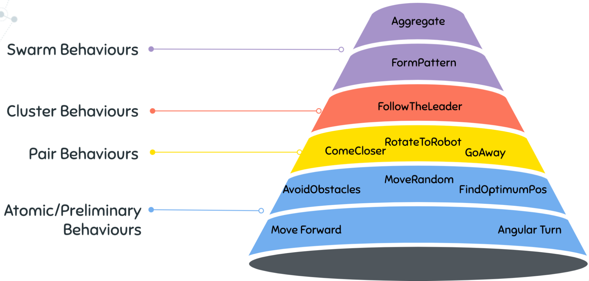
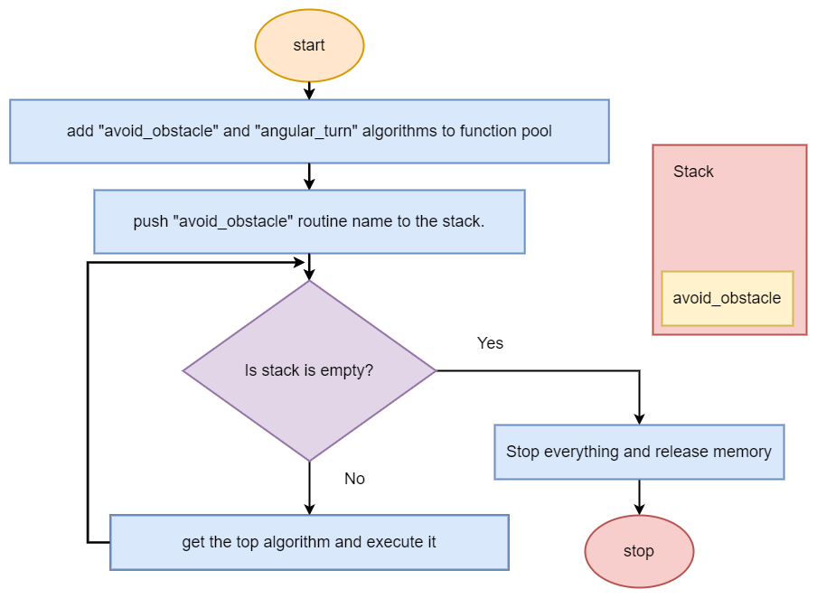
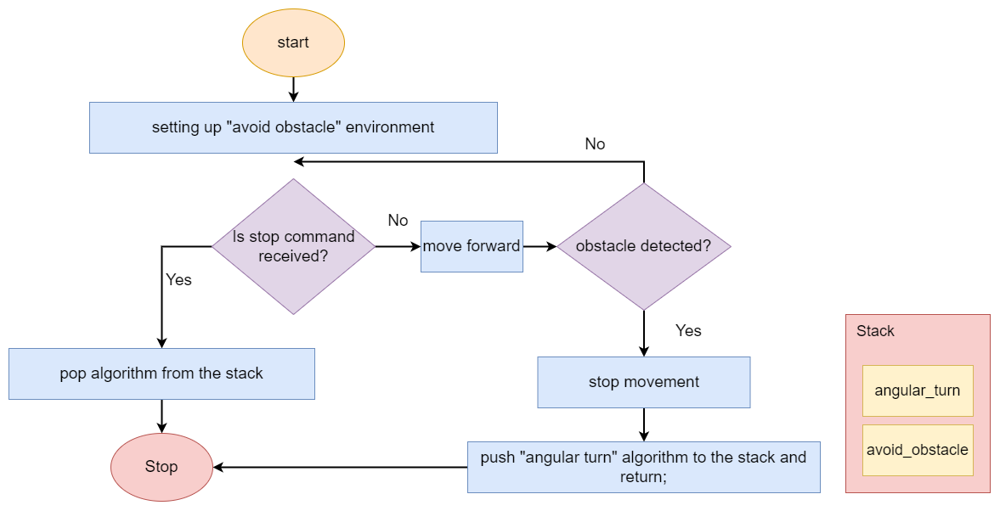
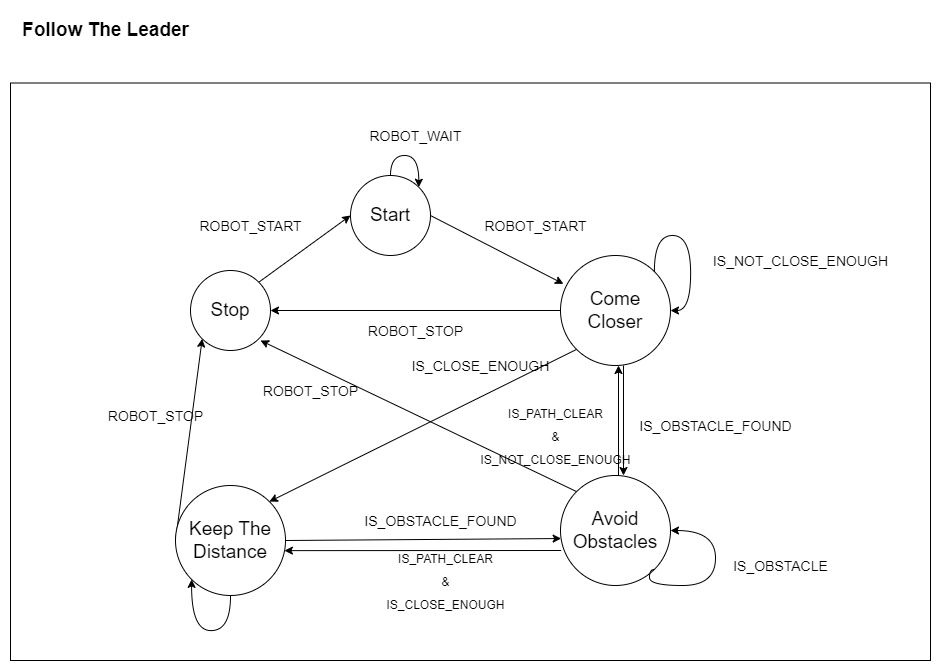
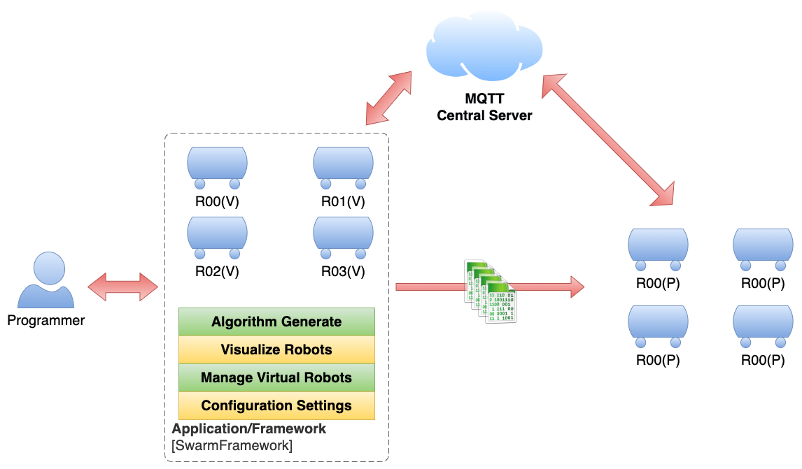
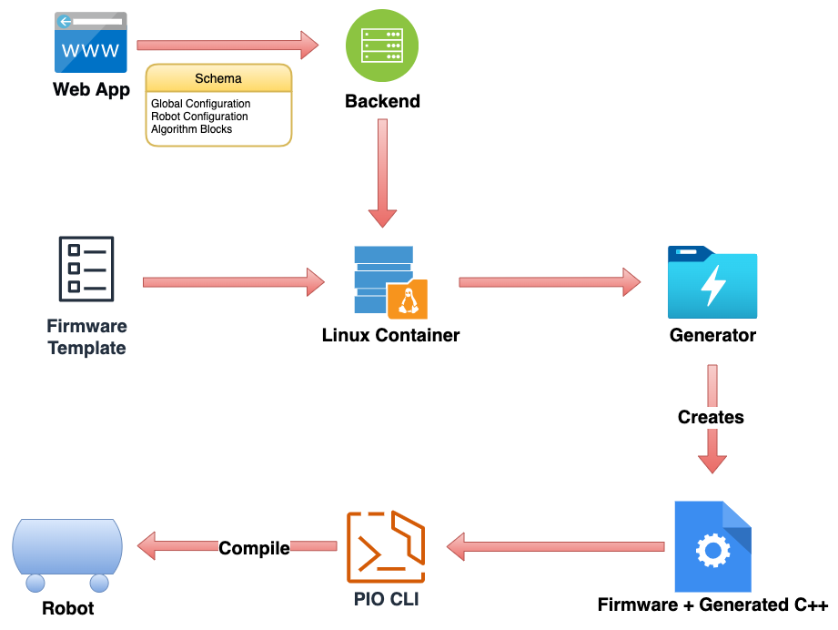
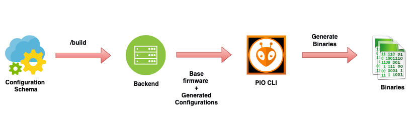
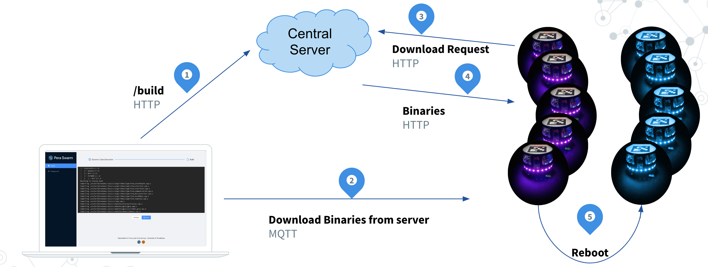

[comment]: # "This is the standard layout for the project, but you can clean this and use your own template"

# Swarm Intelligence Programming Framework

#### Team

- E/16/094, S.M. Ekanayaka, [e16094@eng.pdn.ac.lk](mailto:e16094@eng.pdn.ac.lk)
- E/16/221, H.M.K. Madushanka, [e16221@eng.pdn.ac.lk](mailto:e16221@eng.pdn.ac.lk)
- E/16/275, A.L.H.E. Perera, [e16275@eng.pdn.ac.lk](mailto:e16275@eng.pdn.ac.lk)

#### Supervisors

- Dr. Isuru Nawinne, [isurunawinne@eng.pdn.ac.lk](mailto:isurunawinne@eng.pdn.ac.lk)
- Prof. Roshan Ragel, [roshanr@eng.pdn.ac.lk](mailto:roshanr@eng.pdn.ac.lk)
- Dr. Mahanama Wickramasinghe, [mahanamaw@eng.pdn.ac.lk](mailto:mahanamaw@eng.pdn.ac.lk)
- Dr. Sithumini Ekanayake, [sithuminie@eng.pdn.ac.lk](mailto:sithuminie@eng.pdn.ac.lk)
- Mr. Nuwan Jaliyagoda, [nuwanjaliyagoda@eng.pdn.ac.lk](mailto:nuwanjaliyagoda@eng.pdn.ac.lk)
- Ms. Dilshani Karunarathne, [dilshanik@eng.pdn.ac.lk](mailto:dilshanik@eng.pdn.ac.lk)

#### Table of content

1. [Abstract](#abstract)
2. [Related works](#related-works)
3. [Methodology](#methodology)
4. [Experiment Setup and Implementation](#experiment-setup-and-implementation)
5. [Results and Analysis](#results-and-analysis)
6. [Conclusion](#conclusion)
7. [Publications](#publications)
8. [Links](#links)

---

<!-- DELETE THIS SAMPLE before publishing to GitHub Pages !!!
This is a sample image, to show how to add images to your page. To learn more options, please refer [this](https://projects.ce.pdn.ac.lk/docs/faq/how-to-add-an-image/)
 -->

## Abstract

The presented project is a component of the larger [PeraSwarm](https://pera-swarm.ce.pdn.ac.lk) project, which encompasses a robotic multi-agent systems testbed featuring a variety of robot hardware, virtual robots, and a simulation environment. The specific focus of this project involves the development of a high-level programming and compiler framework that can facilitate the creation of algorithms via "writing" or "drawing", and then translate them into low-level code. This framework is intended to be compatible with various forms of robot hardware, both physical and virtual. 

## Related works

#### **On programming paradigms that abstract lower level hardware functionalities:**

Various programming paradigms have been developed to abstract the lower-level functionalities of hardware in robotics. Such paradigms facilitate the creation of robot control software in high-level programming languages, while still allowing fine-grained control over the hardware. Examples of such programming paradigms include Robot Operating System (ROS), which provides a distributed, modular and component-based framework, and Arduino, which supports C/C++ programming for microcontrollers.

#### **On different frameworks implemented for swarm drones:**

Swarm drones, which are unmanned aerial vehicles (UAVs) that can operate as a collective, have attracted significant research interest in recent years. A number of different software frameworks have been developed for swarm drone applications, including the Aerial Swarms framework, the PX4 framework, and the AirSim simulator. These frameworks provide a range of features, such as formation control, collision avoidance, and obstacle detection, which facilitate the development of swarm drone applications.

#### **On swarm UI frameworks with codeless approaches:**

Swarm UI frameworks are designed to simplify the creation of user interfaces for swarm robotics applications. These frameworks often employ codeless approaches, such as drag-and-drop interfaces, to make it easier for non-technical users to create and modify the interfaces. Examples of swarm UI frameworks include SwarmUI, which provides a web-based interface for configuring and controlling swarm robots, and SwarmBot, which offers a graphical interface for programming swarm robots.

#### **On a modular framework supporting limited hardware architectures called EmSBot:**

EmSBot is a modular framework designed to support a limited range of hardware architectures. The framework consists of a set of hardware modules and software libraries that can be combined to create robot applications. EmSBot provides a range of features, such as support for different sensors and actuators, and allows for the creation of robot applications using C/C++ or Python programming languages.

#### **On EmSBot Script, a smaller virtual machine-based software framework for programming swarm robots:**

EmSBot Script is a smaller virtual machine-based software framework designed to address some of the most challenging aspects of programming swarm robots. The framework allows for the creation of robot applications using a simple scripting language, and provides a range of features such as communication and synchronization mechanisms. EmSBot Script is designed to be lightweight and easy to use, making it a suitable choice for low-end hardware platforms.

## Methodology

Prior to commencing development, we first took a "bottom-up" approach and created models for a range of atomic swarm behaviors. By breaking down complex behaviors into their constituent parts, we were able to better understand how different behaviors interact and contribute to overall swarm behavior. These atomic swarm behaviors were then used to construct more complex swarm behaviors. This knowledge helped guide the development of our high-level programming and compiler framework, enabling us to better support a wide range of swarm behaviors.

    

After creating these behaviors, our focus shifted to the algorithm switching component of our system. We achieved this through the use of a function pool to store different algorithms, and a stack to keep track of the currently executing algorithm. The top-most algorithm on the stack is executed by the robot, and as the situation changes, relevant algorithms are pushed onto the stack accordingly. The following image provides a visual representation of how algorithm switching occurs:

    

    

This approach provides a flexible and efficient way of managing multiple algorithms for a swarm of robots, allowing them to adapt to changing environmental conditions in real-time.

An example of a complex swarm behavior that can be implemented using our atomic swarm behaviors and algorithm switching approach is "Follow the Leader". This behavior involves the robots following a leader robot as it moves through an environment. To implement this behavior, the leader robot executes an algorithm that moves it through the environment, while the follower robots execute an algorithm that enables them to follow the leader.

    

We have all the necessary methodologies at this time to begin implementing our framework.

## Experiment Setup and Implementation

### Big picture
---

In summary, our solution involves a high-level programming and compiler framework for creating swarm behaviors, as well as an architecture that allows for easy deployment of those behaviors to multiple robots. The swarm programmer inputs their desired swarm behavior into our web application, which generates C++ code and firmware using our code generator. Then generated code will be converted into binaries. These binaries are then uploaded to the robots using MQTT, enabling the robots to execute the desired swarm behavior.

    

### Solution Architecture of SwarmFramework
---

    

Our solution consists of a web application that provides an interface for interacting with the swarm programmer, as well as a backend running on a Linux container.

    

When the swarm programmer inputs their desired swarm behavior and dynamic configurations, our algorithm generator generates C++ code, which is then combined with base firmware and fed into PlatformIO Command-Line Interface (CLI) to convert them into binaries. These binaries are then uploaded to the robots, allowing them to execute the desired swarm behavior.

This architecture provides a streamlined and efficient way of generating and deploying swarm behaviors to multiple robots, allowing for rapid iteration and testing of different behaviors. Additionally, our web application interface provides a user-friendly way for swarm programmers to interact with the system and easily generate the desired swarm behavior.

### Over The Air(OTA) Upload
---

    

For over-the-air (OTA) updates of our swarm robot system, we use MQTT messaging to send the generated binaries from our framework to the robots. When an update is available, an MQTT message is sent to the robots directing them to download the relevant binaries from the server. Each robot then downloads the appropriate binaries from the server and installs them, allowing the updated swarm behavior to be executed. 

## Results and Analysis

As a result of our work, we were able to successfully integrate the Google Blockly tool into our system, providing an intuitive way for swarm programmers to create and visualize swarm behaviors. We also developed a custom JavaScript to C++ code generator to convert Blockly JavaScript code into C++ code, allowing the generated code to be executed on our robot hardware. By using MQTT to upload the code to the robots, we were able to successfully demonstrate a color ripple algorithm, highlighting the effectiveness of our approach.

<!--  -->

  <iframe width="560" height="315" src="https://www.youtube.com/embed/QiCPhQCV91k" frameborder="0" allowfullscreen></iframe>

## Conclusion

## Publications
[//]: # "Note: Uncomment each once you uploaded the files to the repository"

<!-- 1. [Semester 7 report](./) -->
<!-- 2. [Semester 7 slides](./) -->
<!-- 3. [Semester 8 report](./) -->
<!-- 4. [Semester 8 slides](./) -->
<!-- 5. Author 1, Author 2 and Author 3 "Research paper title" (2021). [PDF](./). -->

## Links

[//]: # ( NOTE: EDIT THIS LINKS WITH YOUR REPO DETAILS )

- [Project Repository](https://github.com/cepdnaclk/e16-4yp-swarm-intelligence-programming-framework)
- [Project Page](https://cepdnaclk.github.io/e16-4yp-swarm-intelligence-programming-framework/)
- [Department of Computer Engineering](http://www.ce.pdn.ac.lk/)
- [University of Peradeniya](https://eng.pdn.ac.lk/)

[//]: # "Please refer this to learn more about Markdown syntax"
[//]: # "https://github.com/adam-p/markdown-here/wiki/Markdown-Cheatsheet"
